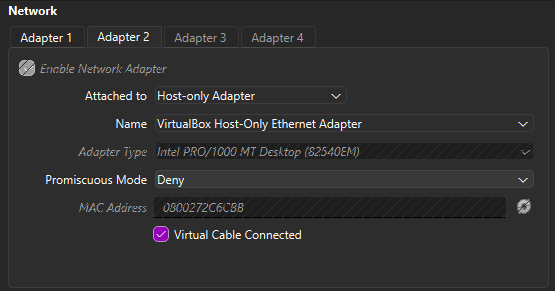
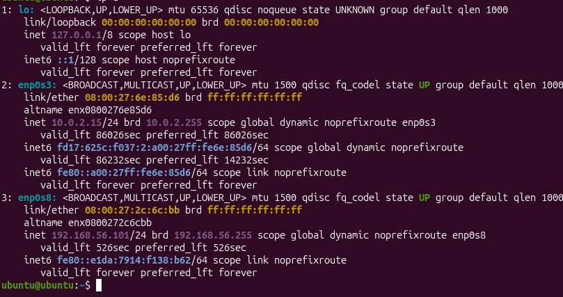
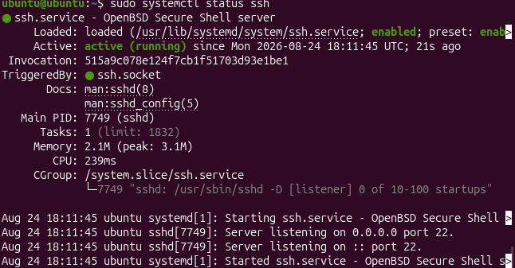
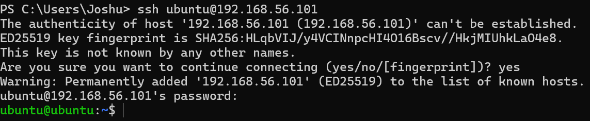
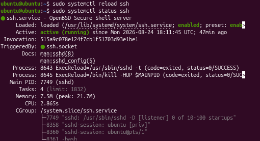
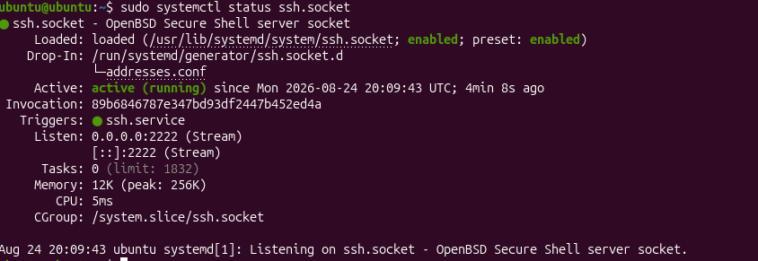
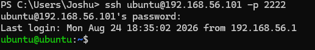

# SSH Hardening & Linux Server Administration Lab

## Summary
This project demonstrates Linux system administration and security hardening techniques applied to an Ubuntu 24.04 LTS server running in VirtualBox. The primary objective was to secure remote administrative access via OpenSSH by enforcing strict authentication policies, changing default service ports, and configuring host firewall rules to reduce the server's attack surface.

## Security Controls Implemented

1. **Disabled Remote Root Authentication**
   * **Action:** Modified `/etc/ssh/sshd_config` to enforce `PermitRootLogin no`.
   * **Rationale:** Prevents attackers from logging directly into the main administrator account over SSH, forcing them to guess a standard username first.

2. **Reconfigured SSH Listening Port**
   * **Action:** Modified `/etc/ssh/sshd_config` and implemented a systemd socket override via `sudo systemctl edit ssh.socket` to set `ListenStream=2222`.
   * **Rationale:** Moving the service off standard TCP Port 22 stops automated scripts and internet bots from constantly trying to brute-force the server.

3. **Configured Host-Based Firewall Rules**
   * **Action:** Executed `sudo ufw allow 2222/tcp` to explicitly permit inbound traffic on the custom SSH port.
   * **Rationale:** Ensures network access controls match service port changes without leaving default ports exposed.

## Environment & Prerequisites

* **Hypervisor:** Oracle VM VirtualBox
* **Guest OS:** Ubuntu Server 24.04 LTS
* **Host OS:** Windows 11 (PowerShell CLI Client)
* **Network Adapter:** Host-Only / NAT Network with Port Forwarding

## Screenshot Evidence

| Screenshot | Description |
| :--- | :--- |
|  | Network adapter configuration settings. |
|  | Network interface configuration output confirming assigned guest IP address. |
|  | Verification of active OpenSSH service status. |
|  | Initial successful remote SSH connection established from Windows PowerShell. |
|  | OpenSSH service successfully reloaded with root authentication disabled. |
|  | Terminal output of `systemctl status ssh.socket` verifying active listener on Port 2222. |
|  | Remote authentication verified via PowerShell using custom Port 2222. |
## Key Takeaways & Troubleshooting

During configuration on Ubuntu 24.04, changing the `Port` parameter in `/etc/ssh/sshd_config` alone did not immediately move the listening port due to **systemd socket activation**. Ubuntu uses `ssh.socket` to handle incoming SSH traffic on default installations. To resolve this, a systemd override was created using `sudo systemctl edit ssh.socket`, changing the port setting to 2222, followed by updating `ufw` firewall rules to allow incoming connections on the new port.
